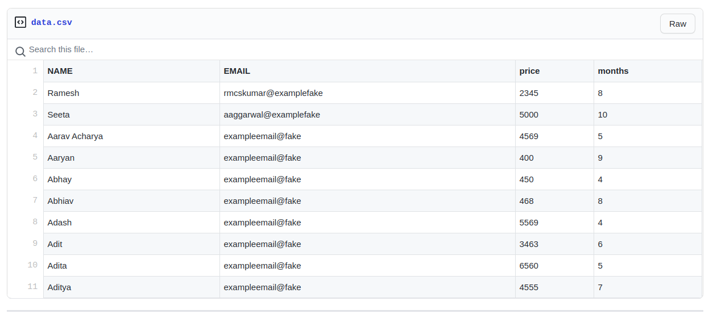

# AutoMailer
Send Templatized Dynamic Emails Automatically 

**This is a simple program which does its work perfectly. Nothing more, nothing less**

1. **Send dynamic emails with unlimited variables pulling data from a database(csv file)**
2. **Supports Markdown Formatting & embed links or images**
3. **Supports Attaching any kind of files**

_Version: **Stable-2.0**_ 

[Click to see ScreenShots](https://github.com/aahnik/AutoMailer/blob/master/README.md#see-sample-screenshots)

## STEP WISE USAGE GUIDE
1. Download or Clone the repo

2. Open the **Automailer Folder** >> Read LICENCE >> open the folder **autoMailerByAahnik**

3. Write your email inside **`compose.md`** (supports markdown formatting)

4. You can use **variables** , **prefix** them with **$** sign.

  Example:
> Hi $NAME , you have Bill Rs. $price due for $months

5. Put your data inside **`data.csv`** file

  Example: 
**the line 1 ie headers must contain 'EMAIL' (uppercase) parameter**

            DISCLAIMER: (just random example data)
            

..... you can add as many lines as you wish 

**You can Export CSV file from Microsoft Office Excel, Libre Office, Google Sheets, SQL Database, or NoSQL Database** [See How]()

6. You you want to put any attachments , put them in the **`ATTACH` folder** inside the `autoMailerByAahnik` folder

7. Open **`creds.py`** file to set DISPLAY_NAME ,SENDER_EMAIL, PASSWORD

> ### do not use original email password. Create a seperate Email Account then turn on 2 step Verification, and then set up an APP PASSWORD

👆 [See How to do]( )
  
## All set up 👍 you are now READY TO GO . RUN the `sender.py` file 

You will be asked to confirm the attachments in `ATTACH` folder. Upon confirmation , the application will start sending Emails 
## You will recieve a full success report after emails are sent

**Having Issues? Errors while Running in your Computer ? Difficulty setting up ?**
Get Premium Support from the creator of AutoMailer for Free Forever
 
[Chat on Telegram](https://t.me/AahnikDaw)

[Chat on WhatsApp](https://wa.me/message/G3FPHWJ3HK4FH1)

# SEE SAMPLE SCREENSHOTS

##### EMAILS SENT THROUGH AUTOMAILER ARE ENCRYPTED AND THEY REACH THE PRIMARY INBOX OF RECEIPIENTS 

##### THEY _DO NOT_ END UP IN SPAM FOLDERS

 

### MADE IN INDIA
(C) AAHNIK DAW 2020 
