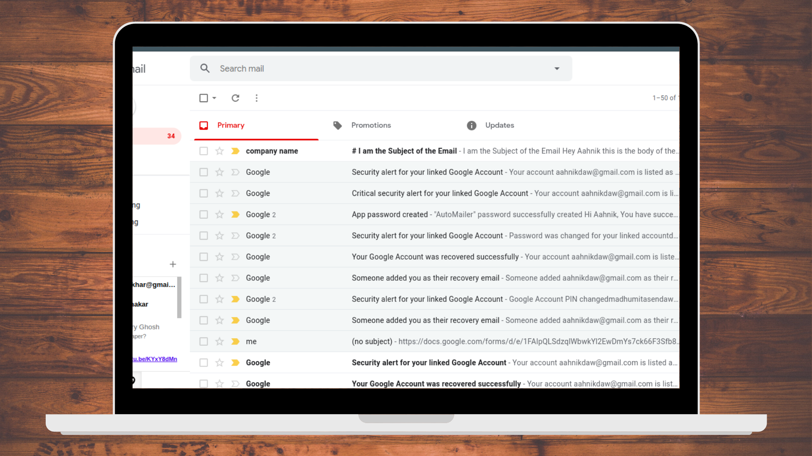
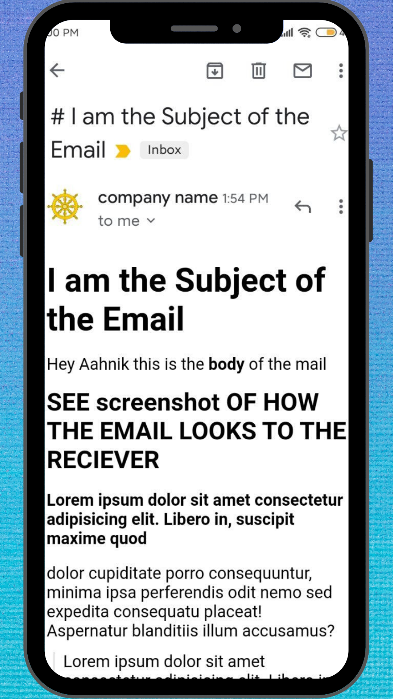

# AutoMailer
Send Templatized Dynamic Emails Automatically 

_Version: **Stable-1.1**_ 
# SEE SAMPLE SCREENSHOTS

##### EMAILS SENT THROUGH AUTOMAILER ARE ENCRYPTED AND THEY REACH THE PRIMARY INBOX OF RECEIPIENTS 

##### THEY _DO NOT_ END UP IN SPAM FOLDERS

 

