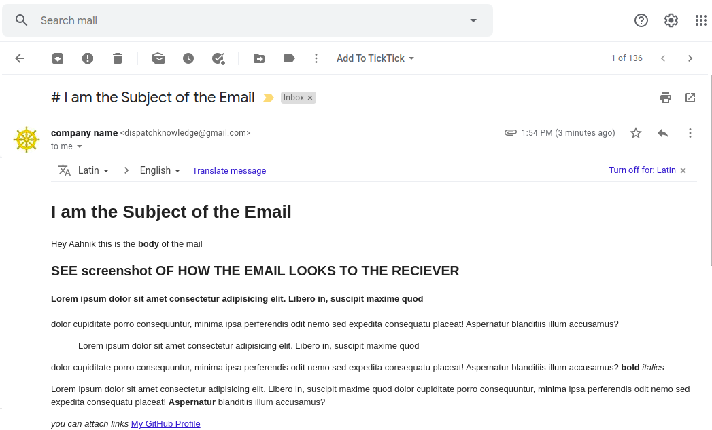
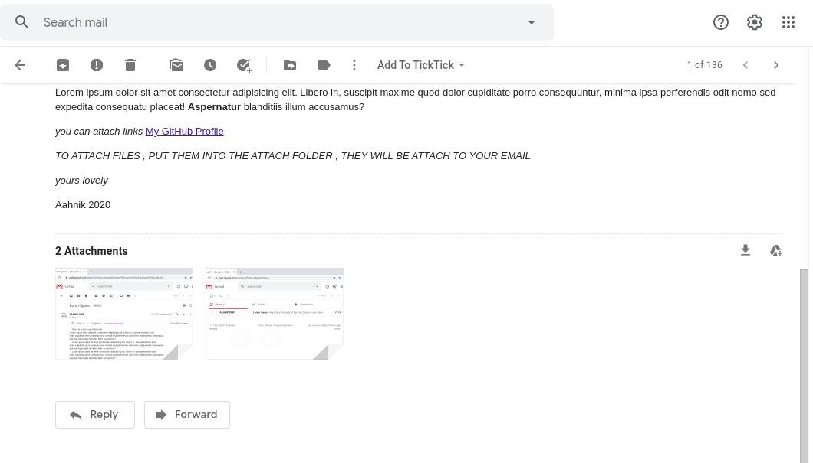
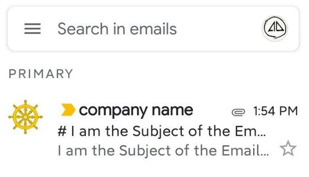
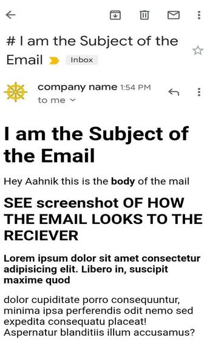
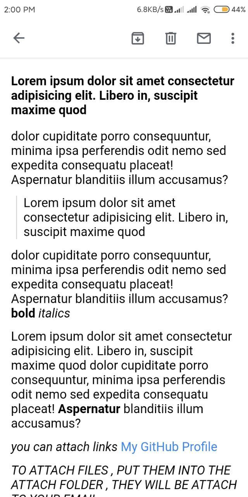
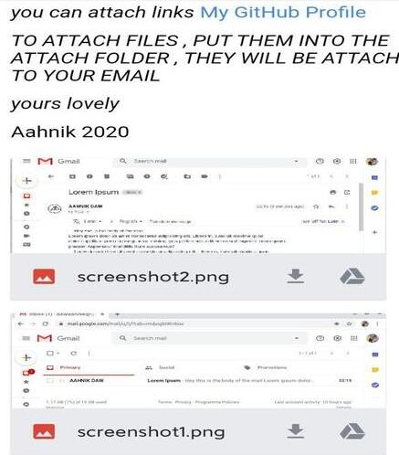

# I am the Subject of the Email

Hey $name this is the **body** of the mail
                    
## SEE screenshot OF HOW THE EMAIL LOOKS TO THE RECIEVER

#### Lorem ipsum dolor sit amet consectetur adipisicing elit. Libero in, suscipit maxime quod 

dolor cupiditate porro consequuntur, minima ipsa perferendis odit nemo sed expedita consequatu
placeat! Aspernatur blanditiis illum accusamus?

> Lorem ipsum dolor sit amet consectetur adipisicing elit. Libero in, suscipit maxime quod 

dolor cupiditate porro consequuntur, minima ipsa perferendis odit nemo sed expedita consequatu
placeat! Aspernatur blanditiis illum accusamus? **bold** _italics_

Lorem ipsum dolor sit amet consectetur adipisicing elit. Libero in, suscipit maxime quod 
dolor cupiditate porro consequuntur, minima ipsa perferendis odit nemo sed expedita consequatu
placeat! **Aspernatur** blanditiis illum accusamus?

_you can attach links_
[My GitHub Profile](github.com/aahnik)

_TO ATTACH FILES , PUT THEM INTO THE ATTACH FOLDER , THEY WILL BE ATTACH TO YOUR EMAIL_

*yours lovely*

Aahnik 2020

# SEE SAMPLE SCREENSHOTS

##### EMAILS SENT THROUGH AUTOMAILER ARE ENCRYPTED AND THEY REACH THE PRIMARY INBOX OF RECEIPIENTS 

##### THEY _DO NOT_ END UP IN SPAM FOLDERS

